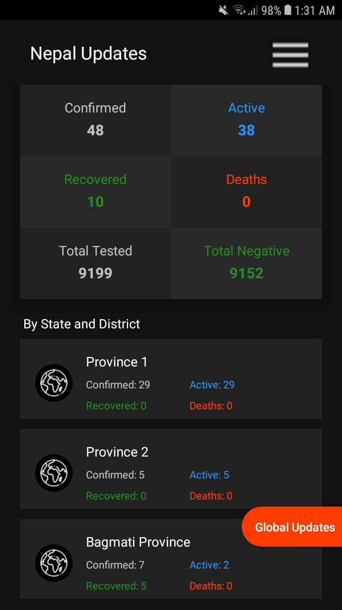
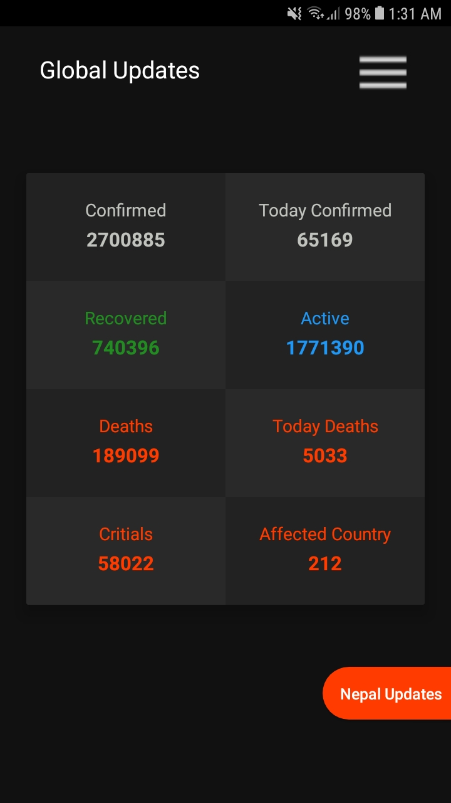
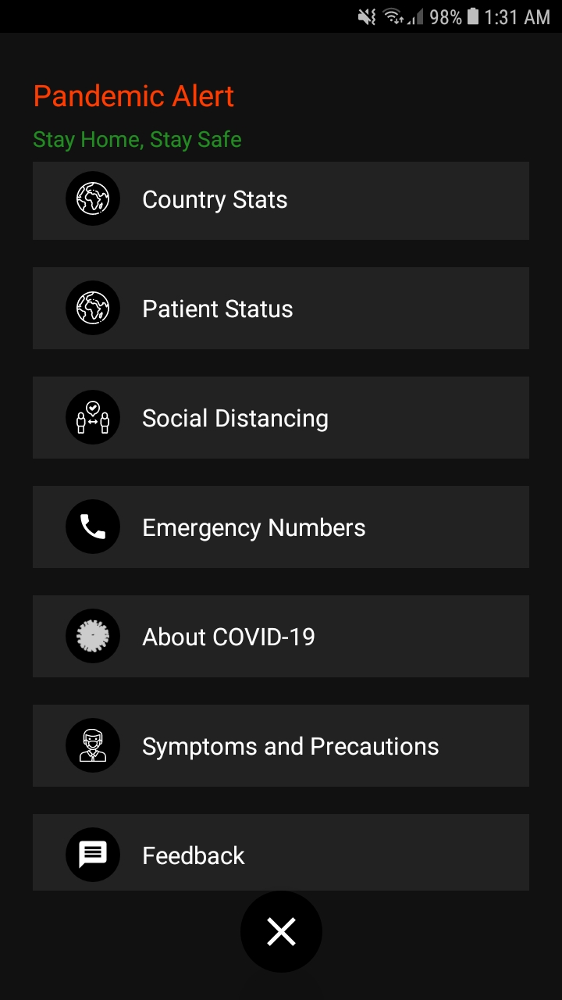
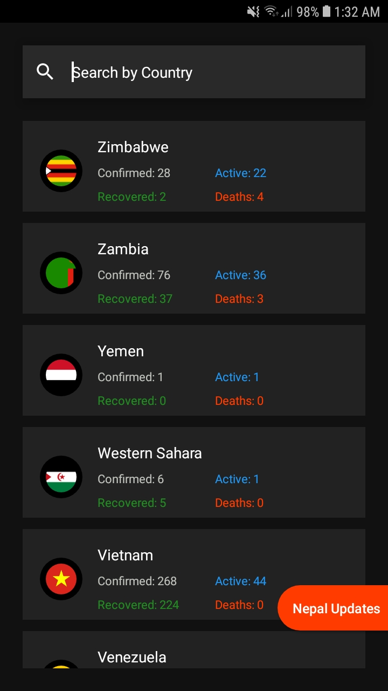

# PandemicAlert
The Pandemic Alert is an Android application that provides the latest information updates about the Corona Virus(COVID-19) from Nepal as well as all Corona affected countries of the world. And helps to manage social distancing.

# Screenshots
<table style="width:100%">
  <tr>
    <th>Nepal Updates</th>
    <th>Global Updates</th>
    <th>Dashboard</th>
    <th>Search By Country</th>
  </tr>
  <tr>
    <td></td>
    <td></td> 
    <td></td>
    <td></td>
  </tr>
</table>

# Credits
Thanks to [nepalcovid19.org](https://api.nepalcovid19.org) and [Postman CORONAVIRUS COVID19 API](https://documenter.getpostman.com/view/10808728/SzS8rjbc?version=latest) for open-source API.
